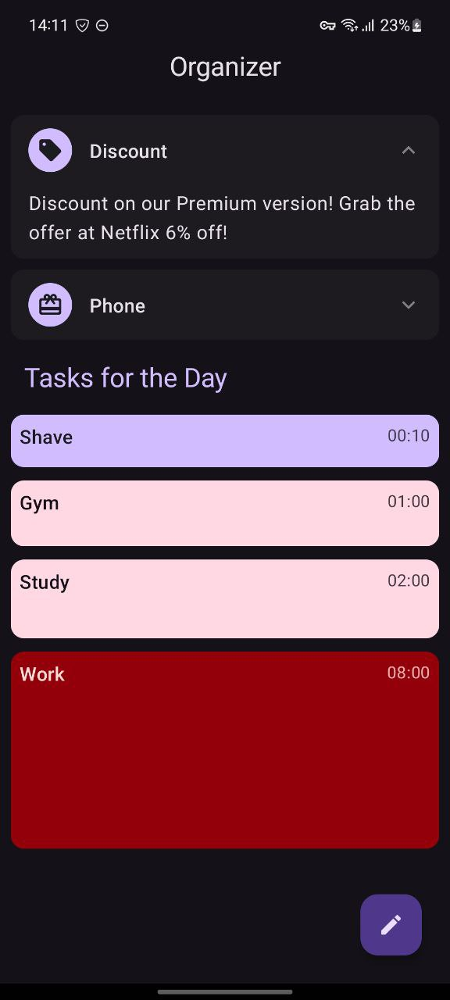
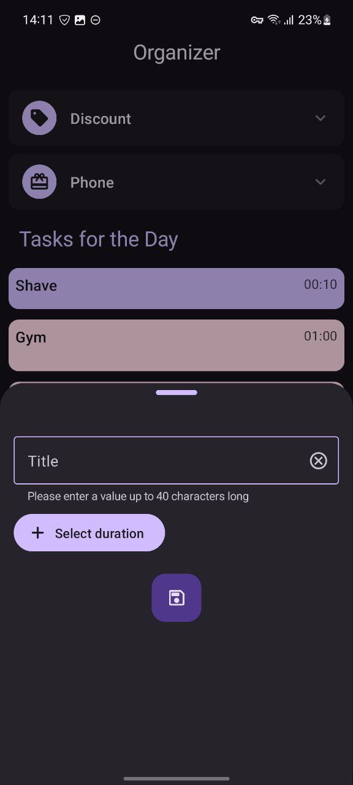
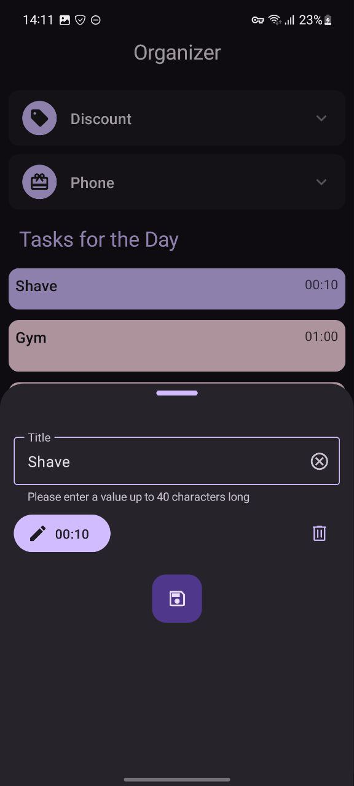
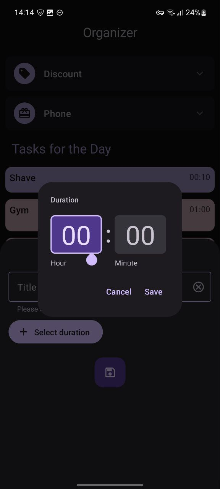

# Organizer
## Banners
Banners are updated daily. There are 2 types of banners: product and discount. Banners are stored in internal storage as JSON and then serialized to separate data classes.

## Tasks
Tasks are stored in shared database using SQLDelight. Task consists of title and duration.According to duration the height and color of task is calculated. Every day old tasks are deleted. The user can create new tasks or update/delete already existing ones.

---
## Tech stack
- Kotlin Multiplatform
- Jetpack Compose
- Clean Architecture
- MVI ([MVIKotlin](https://github.com/arkivanov/MVIKotlin))
- [Decompose](https://github.com/arkivanov/Decompose)
- [Koin](https://github.com/InsertKoinIO/koin)
- [SQLDelight](https://github.com/cashapp/sqldelight)
- Kotlin Flows
- Kotlin Coroutines
- Kotlinx.Serialization
- Material3
- WorkManager
- [Moko Resources](https://github.com/icerockdev/moko-resources)
- [Kermit Logger](https://github.com/touchlab/Kermit)

---
## Screenshots
### Main screen

### Bottom sheet

